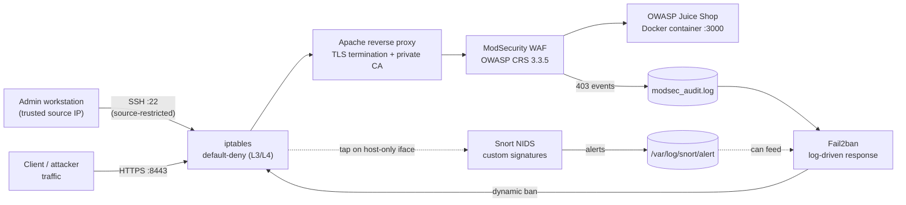

# Defense-in-Depth Lab — Hardening a Vulnerable Web App with iptables, TLS/PKI, WAF, IDS & IPS


A progressive blue-team hardening exercise: **iptables → TLS reverse proxy (private PKI) → ModSecurity WAF (OWASP CRS) → Snort NIDS → Fail2ban-driven IPS**, built and validated end-to-end against a live, intentionally vulnerable target (OWASP Juice Shop) in an isolated VM lab. Every layer is tested with a real attack (XSS, port scans, sensitive-file disclosure, SYN flood) and the evidence is captured.

> **Educational lab, not a production deployment.** Built entirely inside an isolated VirtualBox host-only network (`192.168.56.0/24`) against a deliberately vulnerable target (OWASP Juice Shop). No real systems, credentials, or public IPs are involved.

---

## Overview

**Context.** OWASP Juice Shop is an intentionally vulnerable e-commerce web app, run here as the "production" target of a simulated client engagement. The brief: expose the site to the network, keep a working admin channel, and progressively add detection (IDS) and prevention (IPS) capabilities — then prove each control works with evidence, the way a security team would document it for a client.

**Threat model addressed.** An externally-reachable web app is subject to: unencrypted traffic interception, unrestricted network access to management/administrative ports, application-layer attacks (XSS, injection), reconnaissance (port scanning), sensitive data exposure, and denial-of-service. Each of these is mapped to a concrete control below.

**Approach.** Rather than bolting on a single tool, the lab builds *layered* defense — network filtering, transport encryption, application firewalling, network intrusion detection, and automated response — so that a failure or bypass in one layer doesn't collapse the whole posture. Section "Challenges & Solutions" documents a case where exactly this happened (a WAF bypass) and how the layering caught it.

---

## Architecture / Defense Flow



Two enforcement points matter most:
- **Reverse-proxy-or-nothing**: the app's internal port is locked to loopback so *all* traffic — legitimate or malicious — is forced through the TLS-terminating, WAF-inspected path.
- **Log-to-action loop**: ModSecurity's audit log is the input Fail2ban watches; a repeat offender detected at L7 gets banned at L3/L4, closing the loop between detection and network-level prevention.

---

## Methodology

The build follows a deliberate **detect-before-prevent** progression — each control is validated in observation/detection mode before being switched to active blocking, to avoid false-positive outages:

| Stage | Control | Mode |
|---|---|---|
| 1 | `iptables` | Prevention from the start (default-deny is the baseline, not an add-on) |
| 2 | TLS reverse proxy + private CA (Easy-RSA) | N/A — encryption/termination |
| 3 | ModSecurity WAF (OWASP CRS 3.3.5) | **Detection first** (`SecRuleEngine DetectionOnly`) → then **Prevention** (`SecRuleEngine On`) |
| 4 | Snort NIDS | Detection (custom signatures, no inline blocking) |
| 5 | Fail2ban | Prevention (log-driven, translates repeated L7/L4 violations into `iptables` bans) |
| Final | 5 targeted detection/prevention exercises | Mixed — see *Findings* |

No formal audit framework (e.g. PTES/NIST) was mandated for this exercise; the OWASP Core Rule Set is the one named standard in use, visible directly in the WAF's own audit log output.

---

## Tech Stack & Tools

| Layer | Tool / Tech |
|---|---|
| OS / virtualization | Debian-based Linux VM (Ubuntu 24.04.1 LTS per the lab's terminal output), VirtualBox host-only networking |
| Target application | OWASP Juice Shop (`bkimminich/juice-shop`), Docker |
| Network filtering | `iptables` (default-deny, stateful `conntrack`) |
| Reverse proxy / TLS | Apache2 (`mod_ssl`, `mod_proxy`, `mod_proxy_http`) |
| PKI | Easy-RSA (self-signed internal CA), OpenSSL |
| WAF | ModSecurity v2 (`libapache2-mod-security2`) + OWASP Core Rule Set 3.3.5 |
| NIDS | Snort (custom local rules, systemd-managed) |
| IPS / active response | Fail2ban (custom jail + filter, `iptables-multiport` action) |
| Attack simulation tooling | `curl`, `nmap` (XMAS scan), `hping3` (SYN flood), `tcpdump` (packet-level verification) |

---

## Setup / Lab Environment

- **Target VM**: Debian-based Linux, host-only interface (e.g. `enp0s8`) on `192.168.56.0/24`, DHCP-assigned.
- **Admin workstation**: separate host on the same host-only network (`192.168.56.1`), used for SSH administration and as the Snort/`nmap` test source.
- **Application**: Juice Shop container listening on `127.0.0.1:3000` (internal only — see the WAF-bypass fix below for why it isn't exposed directly).
- **Public-facing port**: `8443/tcp` — the only externally reachable path, terminating TLS at Apache.

Reproduce the network baseline:
```bash
sudo bash configs/iptables/apply_rules.sh
sudo apt-get install -y iptables-persistent
sudo iptables-save | sudo tee /etc/iptables/rules.v4
```

---

## Execution / Usage

```bash
# 1) Firewall baseline (default-deny + minimal allow-list)
sudo bash configs/iptables/apply_rules.sh

# 2) TLS reverse proxy
sudo apt-get install -y apache2 easy-rsa
#   -> build the CA and issue a server cert (see ARCHITECTURE.md)
sudo cp configs/apache/juice_shop-vhost.conf /etc/apache2/sites-available/juice_shop.conf
sudo a2enmod ssl proxy proxy_http && sudo a2ensite juice_shop.conf
sudo systemctl restart apache2

# 3) WAF (ModSecurity + OWASP CRS)
sudo apt-get install -y libapache2-mod-security2
sudo cp configs/modsecurity/custom_rules.conf /etc/modsecurity/
#   -> apply configs/modsecurity/modsecurity.conf.snippet directives
sudo systemctl restart apache2

# 4) NIDS (Snort)
sudo apt-get install -y snort
sudo cp configs/snort/local.rules /etc/snort/rules/local.rules
sudo cp configs/systemd/alert-snort.service /etc/systemd/system/
sudo systemctl daemon-reload && sudo systemctl enable --now alert-snort

# 5) IPS (Fail2ban)
sudo apt-get install -y fail2ban
sudo cp configs/fail2ban/jail.local /etc/fail2ban/jail.local
sudo cp configs/fail2ban/filter.d/modsec.conf /etc/fail2ban/filter.d/modsec.conf
sudo systemctl restart fail2ban
```

---

## Findings / Results

| # | Scenario | Test performed | Detection | Prevention | Evidence |
|---|---|---|---|---|---|
| 1 | Reflected XSS via `id` parameter | `<script>alert('XSS')</script>` in URL | ModSecurity / OWASP CRS rules `941110` + `941160`, inbound anomaly score **10 (CRITICAL)** | `403 Forbidden` once `SecRuleEngine On` | `screenshots/03-waf-modsecurity/04-modsec-audit-log-xss-detected.png` |
| 2 | **WAF bypass** via direct backend access | `curl` straight to the app's internal port, skipping the reverse proxy | ❌ Invisible to the WAF (root cause identified) | **Fixed**: `iptables` restricts the backend port to loopback only; external attempts `REJECT`ed | `screenshots/03-waf-modsecurity/05-06` |
| 3 | Unauthorized SSH source | SSH attempt from a non-admin IP | Custom Snort rule (`sid:10000010`, `classtype:attempted-admin`) | — (detection-only; extendable via a Fail2ban SSH jail) | `screenshots/06-exercises/01` |
| 4 | XMAS scan reconnaissance | `nmap -sX -Pn` | Custom Snort rule matching `flags:FPU` (`sid:10000011`) | — (recon detection) | `screenshots/06-exercises/03-05` |
| 5 | Sensitive file disclosure | Direct fetch of `/ftp/acquisitions.md` | Custom Snort HTTP rule on `http_uri` (`sid:10000012`) | — (flagged as `policy-violation`) | `screenshots/06-exercises/10-12` |
| 6 | Unauthorized `/about-you` access | Direct request to the endpoint | — | ModSecurity custom rule, `phase:1`, `deny` → `403` | `configs/modsecurity/custom_rules.conf` |
| 7 | SYN flood (DoS) | `hping3 --syn` | Snort rate-based threshold (100 SYN/src/sec, `sid:10000020`) | `iptables` per-source ban / `hashlimit` rate-limiting | `configs/iptables/apply_rules.sh` |
| 8 | Repeated WAF violations | 3× malicious requests through the proxy | ModSecurity audit log | Fail2ban auto-bans the source IP via `iptables-multiport`; next request is refused | `screenshots/05-ips-fail2ban/05-07` |

---

## Screenshots / Evidence

Organized to mirror the build order:

```
screenshots/
├── 01-firewall/            # default-deny policy, SSH validation, syslog/DHCP
├── 02-tls-reverse-proxy/   # CA creation, vhost config, CA trust import (Windows/Firefox)
├── 03-waf-modsecurity/     # XSS test, ModSecurity install, OWASP CRS detection log, bypass + fix
├── 04-ids-snort/           # Snort install, local rule, live console alert, systemd service
├── 05-ips-fail2ban/        # jails, filter, ban applied, 403 after ban
└── 06-exercises/           # unauthorized SSH, XMAS scan, sensitive-file disclosure
```

Highlights: `03-waf-modsecurity/04-modsec-audit-log-xss-detected.png` (OWASP CRS rule match with anomaly scoring) and `06-exercises/12-ex3-acquisitions-md-leaked-content.png` (the disclosed file — Juice Shop's own built-in decoy content, not real company data).

---

## Challenges & Solutions

- **TLS trust chain rejected on the client.** The reverse proxy's certificate is signed by a private lab CA, which browsers/`curl` don't trust by default. → Imported the CA into the OS trust store (Windows `certmgr`) *and* separately into Firefox, which keeps its own certificate store independent of the OS.
- **Certificate name mismatch (CN/SAN vs. connection URL).** Connecting by IP to a certificate issued for a hostname (`CN=juice_shop`) triggers a "hostname mismatch" TLS error. → Two valid fixes identified: map the hostname locally (`/etc/hosts`) or reissue the certificate with a SAN entry covering the IP (the more correct long-term fix).
- **WAF bypass via a secondary backend port.** A direct `curl` to the app's internal port produced the exact same XSS response *without any ModSecurity log entry* — the reverse proxy, and therefore the WAF, was simply out of the traffic path. → Closed at the network layer: `iptables` restricts that port to loopback, forcing every request through the inspected path. This is the clearest "defense-in-depth" moment in the lab — one control's blind spot is closed by another layer, not by patching the WAF itself.
- **Snort blind on the TLS-terminated port.** Signatures matching on `http_uri` (e.g. the `acquisitions.md` rule) never fired when Snort watched the public `8443` interface, because that traffic is encrypted end-to-end at that point. → Architectural fix: Snort has to sit where the HTTP request is still cleartext (loopback, or upstream of TLS termination) to inspect application-layer content — a distinction that's easy to miss when treating "the network interface" as a single inspection point.

---

## Key Takeaways

- A control can be perfectly configured and still miss everything if traffic doesn't actually flow through it — validating the *path*, not just the *rule*, is part of the job (see the WAF bypass above).
- Detect-before-prevent (`DetectionOnly` → `On`) is a deliberate methodology to avoid shipping a WAF that blocks legitimate traffic on day one.
- Writing custom Snort/ModSecurity/Fail2ban signatures — rather than only relying on default rulesets — is what turns "I installed an IDS" into "I can detect the specific behavior I care about."
- Rate-based DoS detection has known, documented limits (distributed sources, spoofed addresses, low-and-slow traffic, flag/port variation) — naming those limits is as much a part of the deliverable as the detection rule itself.

---

## Repository Structure

```
juice-shop-ids-ips-lab/
├── README.md
├── ARCHITECTURE.md
├── .gitignore
├── configs/
│   ├── iptables/apply_rules.sh
│   ├── apache/{juice_shop-vhost.conf, ports.conf.snippet}
│   ├── modsecurity/{modsecurity.conf.snippet, custom_rules.conf}
│   ├── snort/local.rules
│   ├── fail2ban/{jail.local, filter.d/modsec.conf}
│   └── systemd/alert-snort.service
└── screenshots/  (01-firewall … 06-exercises)
```
